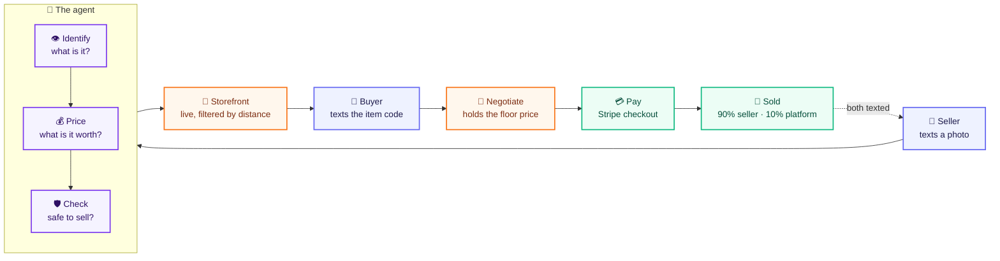
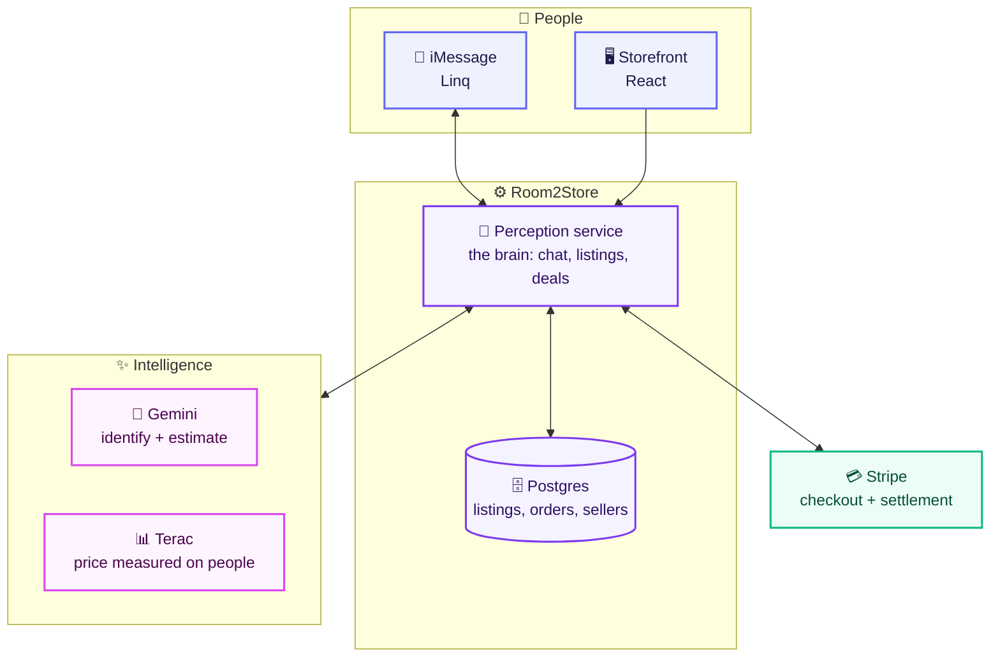
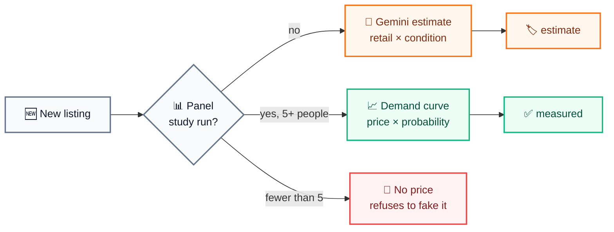

# Room2Store

Text a photo of something you want to sell. An agent identifies it, prices it,
publishes it to a storefront, negotiates with buyers over iMessage, and settles
the payment — 90% to the seller, 10% to the platform.

**Live:** [storefront](https://room2store-web.onrender.com/store) ·
[API health](https://room2store-perception.onrender.com/health)

---

## How it works



Everything happens over iMessage. The seller never opens an app; the buyer only
opens the storefront to browse.

## What each piece runs on



## The one idea that matters

A price is either **measured on real people** or it is a **guess** — and the
product never confuses the two.



Condition sets the discount off retail — new 70–85%, excellent 55–70%,
good 40–55%, fair 25–40%. The same speaker is $759 new and $310 fair.

## Services

| Path | What it does |
| --- | --- |
| `services/perception` | Linq webhook, vision, listings, deals, Stripe, Terac |
| `services/compliance` | Prohibited categories, unverifiable claims, PII |
| `services/orchestrator` | Band rooms, gate engine, runtime specialists |
| `services/api` | REST API and Postgres schema |
| `services/web` | Buyer storefront |
| `workflows` | Render Workflows DAG and price decay |
| `packages/contracts` | Shared entities, Band protocol, fixtures |

## Running it

```bash
pnpm install
pnpm typecheck          # all six workspace packages
npm test                # 146 tests
npm run dev:perception  # reads .env
```

Diagnostics: `npm run linq:verify -- <url>`, `npm run gemini:models`,
`npm run pioneer:probe`.

## Honest limits

- **Sellers are not paid automatically.** Single Stripe account: the platform
  collects the full amount and the 90/10 split is recorded on the order as a
  ledger, settled out of band. Stripe Connect would change this and needs
  per-seller identity verification.
- **Stripe runs in test mode.** Real card numbers are rejected; use
  `4242 4242 4242 4242`.
- **Band agents authenticate but do not answer.** All eight are registered as
  external, so Band is a message bus rather than a runtime — our services post
  under those identities. The gates that read room history are real either way.
- **In-flight negotiations live in memory** and are lost on redeploy. Published
  listings, orders and sellers are in Postgres and survive.
