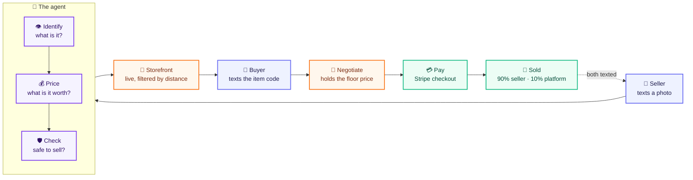
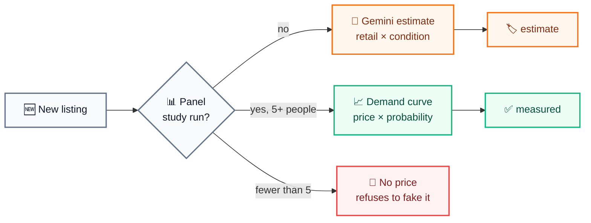
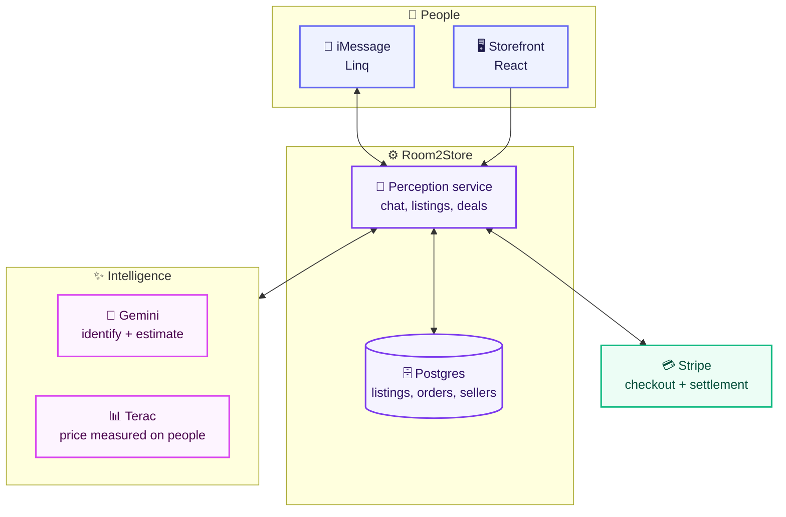

<div align="center">

# 🏪 Room2Store

### Text a photo. Get it sold.

**An agent that identifies your stuff, prices it, lists it, haggles for you, and takes the payment — entirely over iMessage.**

[](https://youtu.be/e0K2lcmH83E?is=2CqFCVOJJmfxhWoj)
[](https://room2store-web.onrender.com/store)
[_455--9546-10B981?style=for-the-badge)](sms:+12134559546)


</div>

---

## Try it right now

**Sell something** — text a photo to **+1 (213) 455-9546**. The agent replies in
seconds, asks two questions, and your item is live.

**Buy something** — open the [storefront](https://room2store-web.onrender.com/store),
find something near you, tap **Interested**. You are texting the agent, and it
negotiates on the seller's behalf.

> 💳 Payments run in Stripe test mode. Use card `4242 4242 4242 4242` — real
> cards are rejected and no money moves.

---

## How it works



The seller never opens an app. The buyer only opens the storefront to browse.

---

## What it looks like

**Selling**

```
You  📷 [photo of a speaker]
     Got it — looking at your photo now.

     Looks like a used QSC black PA speaker on stand.
     What condition is it in — new, excellent, good, or fair?
You  fair
     What ZIP code is it in for pickup?
You  95134
     Your listing is live · $310 · San Jose, CA
```

**Buying**

```
You  R2S-GNVD
     QSC black PA speaker on stand · fair · $310
You  would you take 200?
     That is below what the seller will take.
     The lowest I can go is $250. Say yes and it is yours.
You  yes
     Offer of $250 sent to the seller.
     ─────────────────────────────────
     [seller]  YES  →  pickup address + time
     ─────────────────────────────────
     The seller accepted $250. Pay here: stripe.com/…
```

---

## The one idea that matters

A price is either **measured on real people** or it is a **guess** — and the
product never confuses the two.



A measured price maximises `price × probability of purchase` across a real
panel's willingness to pay. The floor is the highest price three in four would
still pay — and no wording ever talks the agent below it.

Condition sets the discount off retail: **new** 70–85%, **excellent** 55–70%,
**good** 40–55%, **fair** 25–40%. The same speaker is $759 new and $310 fair.

---

## What each piece runs on



Every inbound webhook is signature-verified and fails closed — Linq, Terac and
Stripe all reject an unsigned or replayed request with `401`.

| Path | What it does |
| --- | --- |
| `services/perception` | Linq webhook, vision, listings, deals, Stripe, Terac |
| `services/compliance` | Prohibited categories, unverifiable claims, PII |
| `services/orchestrator` | Band rooms, gate engine, runtime specialists |
| `services/api` | REST API and Postgres schema |
| `services/web` | Buyer storefront |
| `workflows` | Render Workflows DAG and price decay |
| `packages/contracts` | Shared entities, Band protocol, fixtures |

---

## Safety

The agent refuses to list what it should not sell. A prohibited item is stopped
**before** it is published, not flagged afterwards, and the seller is told which
rule fired rather than just "no":

- 🚫 Weapons, medication, recalled goods, used car seats
- 🚫 A street address in public listing copy
- 🚫 An item the seller asked to be excluded
- ⚠️ Unverifiable claims — "brand new", "guaranteed authentic"

---

## Running it

```bash
pnpm install
pnpm typecheck          # all six workspace packages
npm test                # 146 tests
npm run dev:perception  # reads .env
```

Copy `.env.example` to `.env` and fill in the keys you have. Everything degrades
gracefully: no Postgres runs in memory, no Terac falls back to a Gemini
estimate, no Stripe stops before checkout with a clear message.

**Diagnostics:** `npm run linq:verify -- <url>` · `npm run gemini:models` ·
`npm run pioneer:probe`

---

## Honest limits

Worth stating plainly rather than letting someone discover them:

- **Sellers are not paid automatically.** One Stripe account collects the full
  amount; the 90/10 split is recorded on the order as a ledger and settled out
  of band. Stripe Connect would automate it and needs per-seller identity
  verification.
- **Stripe runs in test mode.** Real cards are rejected. One environment
  variable makes it live.
- **Band agents authenticate but do not answer.** All eight are registered as
  external, so Band is a message bus rather than a runtime — our services post
  under those identities. The gates that read room history are real either way.
- **In-flight negotiations live in memory** and are lost on redeploy. Listings,
  orders and sellers are in Postgres and survive.

---

## License

[MIT](LICENSE) — do what you like with it.

<div align="center">
<sub>Priced by real people, sold by agents</sub>
</div>
